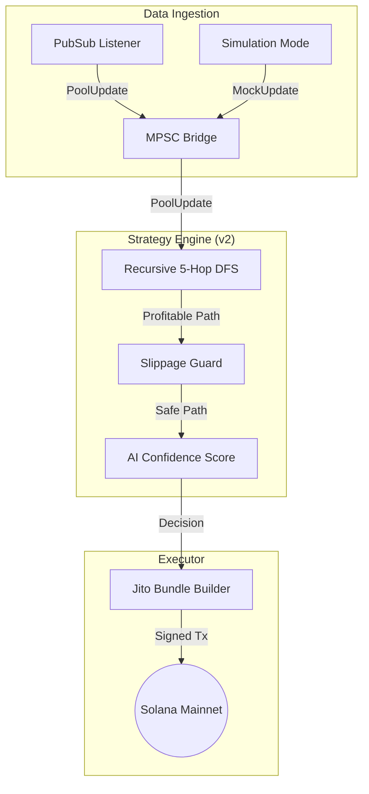

# Project Progress Report: Solana MEV Arbitrage Bot

This document provides a comprehensive review of the development progress, architecture, and current capabilities of the Solana MEV Arbitrage Bot.

## Executive Summary
The project has successfully moved from initial scaffolding to a sophisticated, AI-enhanced arbitrage system. We have implemented a high-performance modular architecture in Rust, capable of real-time market ingestion, multi-DEX pathfinding, and atomic transaction execution via Jito bundles.

---

## 🚀 Phase 1: Market Listener (Completed)
**Focus:** Real-time data ingestion and foundational data structures.
- **Raydium V4 Integration:** Defined binary-perfect `AmmInfo` layouts in the `core` crate using `bytemuck` for zero-copy deserialization.
- **PubSub Listener:** Implemented a non-blocking WebSocket-based listener in the `engine` crate that streams live account updates from Solana Mainnet.
- **modular Crate Structure:** Established a 4-crate workspace (`core`, `engine`, `strategy`, `executor`) to maintain strict separation of concerns.

## 📈 Phase 2: Strategy & Routing (Completed)
**Focus:** Accuracy, multi-DEX support, and arbitrage math.
- **CPMM Math Implementation:** Added [math.rs](file:///Users/lycanbeats/Desktop/Rust%20AI%20Chatbox/core/src/math.rs) for precise Constant Product ($x \cdot y = k$) calculations.
- **Reserve-Aware Pathfinding:** The `strategy` engine now uses a directed graph (`petgraph`) where edges represent pools with real-time reserves, allowing for exact profit prediction.
- **Orca Whirlpool Ready:** Defined concentrated liquidity layouts in [orca.rs](file:///Users/lycanbeats/Desktop/Rust%20AI%20Chatbox/core/src/orca.rs) for future expansion.
- **Mainnet Triangular Surface:** Configured the bot to monitor the SOL/USDC -> SOL/RAY -> RAY/USDC triangular cycle.

## 🧠 Phase 3: AI Integration (Completed)
**Focus:** Decision confidence and high-performance inference.
- **AI Strategy Engine:** Developed the `StrategyEngine` utilizing **ONNX Runtime (`ort`)** for sub-millisecond confidence scoring.
- **Hybrid Logic:** The system uses a "Two-Factor" verification: 
    1. **Heuristic:** Must be mathematically profitable.
    2. **AI:** Must have a confidence score > 0.7.
- **Asynchronous Pipeline:** Refactored the engine to use `tokio::sync::mpsc` channels and a bridge for `crossbeam`, ensuring high-throughput, low-latency event flows.
- **Heuristic Fallback:** Implemented a resilient mode that allows the bot to trade via standard math if the AI model is unavailable.

---

## 🛡️ Phases 4-7: Operational Resilience & Hardening (Completed)
**Focus:** Reliability, Multi-Hop pathfinding, and Quality Assurance.
- **Jito Soft-Fail:** Implemented logic to allow data harvesting and simulation even if Jito credentials are pending.
- **Arbitrage v2:** Upgraded pathfinding from 3-token triangles to **Recursive 5-Hop DFS**, significantly expanding the search space.
- **Slippage & Price Impact:** Added proactive math to `core` to reject trades with > 1.0% price impact, protecting capital.
- **Comprehensive Testing:** Added unit and integration tests across `core` and `strategy` to verify math and cycle detection.
- **Technical Documentation:** Created detailed guides for [Strategy](docs/STRATEGY.md) and [Development](DEVELOPMENT.md).

## 🏗️ Architecture Diagram

## 📋 Next Steps
1. **Live Data Retraining:** Run the bot in `DRY_RUN` with the expanded pool list to collect 24h+ of real market data.
2. **AI Model Retraining:** Execute `train_model.py` with the new data to optimize confidence scores for the 5-hop engine.
3. **Geyser Integration:** Transition to Yellowstone-gRPC for "fastest in class" data ingestion once whitelisted.
