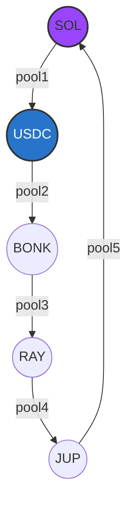

# Arbitrage Strategy & Pathfinding (v2)

This document explains the technical implementation of the bot's arbitrage detection and risk management systems.

## Pathfinding: Multi-Hop Depth-First Search (DFS)

The bot uses a recursive DFS algorithm to find profitable arbitrage cycles in a directed graph where:
- **Nodes** are Token Mints (e.g., SOL, USDC, BONK).
- **Edges** are Liquidity Pools (e.g., Raydium AMM V4).

### Search Space
The algorithm explores paths up to **5 hops** deep. This allows for complex routes that simple triangular bots miss.

## Risk Management: Slippage & Price Impact

To prevent "toxic" trades that lose money due to low liquidity, every hop in a path is validated against **Price Impact**.

### The Math
The bot calculates Price Impact for setiap pool transition:
$$Price Impact = \frac{AmountIn}{ReserveIn + AmountIn}$$

### Guardrails
- **Impact Limit:** Any path containing a hop with **> 1.0% Price Impact** is automatically discarded.
- **Dynamic Simulation:** In simulation mode, mock trades "shift" reserves using the Constant Product formula ($x \cdot y = k$), ensuring the AI trains on realistic price reactions.

## Execution Logic

1. **Event Ingestion:** Listener receives a `PoolUpdate`.
2. **Graph Update:** The edge corresponding to the pool is updated with new reserves.
3. **Cycle Search:** DFS starts from the tokens in the updated pool.
4. **AI Validation:** If a cycle is profitable (> 1 SOL starting), the AI Model (`ai_model.onnx`) is queried for a confidence score.
5. **Jito Submission:** If Confidence > 0.7, a bundle is built and sent to the Jito Block Engine.
